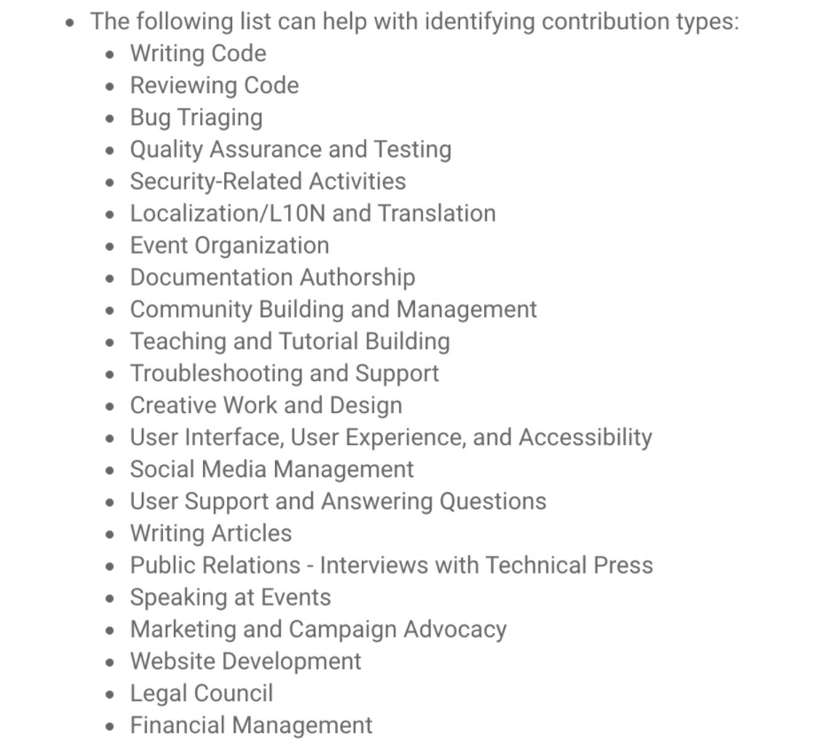

+++
author = "夏小雅"
title = "夏小雅：从认识社区到玩转社区"
date = "2021-01-05"
description = "Get yourself involved in the community"
tags = [
    "开源",
]

+++

# 从认识社区到玩转社区

作者介绍：夏小雅是华东师范大学数据学院的在读研究生，也是X-lab成员之一。

###CHAOSS

CHAOSS（Community Health Analytics Open Source Software）是Linux基金会下专注于开源社区度量标准与软件开发的开源项目。从风险、演化、多样性、价值等角度持续制定与发布指标。

今年参与CHAOSS项目的经历毫无疑问是我的2020最浓墨重彩的一笔，最初只是在每周的开放会议中旁观，偶尔提出一些小的讨论，到六月份开始申请Season of Docs，成为一名技术文档撰写的实习生，到12月开始筹划CHAOSS在中国的第一次Meetup，最终以12月27日Meetup的圆满成功作为落幕。

 从OS Revolution掀起开源革命到现在，“开源”两个字所代表的绝不仅仅是代码开放。依托项目构筑起的社区是一种基于技术的新型数字化组织架构，如何定义一个好的开源社区？依据什么进行开源治理？到现在也很难有体系将这件事完整的讲清楚，这也是CHAOSS这个项目的价值所在，即便我们也很难说CHAOSS的指标体系是合理的、完善的，但是一个为开源度量而存在项目，本身就具有着无穷价值。 

我最感兴趣的是其中“多样性与包容性（D&I）”这个小组的内容，一个致力于定义社区健康度的社区本身应该是相对健康的，一个讨论开源社区D&I指标的小组本身是多样和包容的，这也的确是CHAOSS给我的实际感受。D&I小组用耐心与包容度鼓励着我这个社区新人，并让我意识到任何形式的贡献都是有意义的。

### Google Season of Docs

也是在一次D&I组会上，我得知了Season of Docs这个项目，并产生了申请试试的想法。申请期间我的选题同时有另外两位竞争者，一位来自印度一位来自非洲，我能清晰感受到他们显然是比我更加熟练的英文使用者，因此在这个过程中也感受到了巨大压力。在回答Micro Task和编写proposal时，我格外注意语法和文档的结构性；那段时间几乎每次D&I组会和项目的小会我都会参加，或许也是因此赢得了选拔。 

我的两位导师都非常年轻，实习过程几乎是交朋友的过程，十分快乐。虽然有时候会因为口语交流和时差问题感到压力，但是每次线上见面，听到对方的“How you doing today？”，听到对方对于每周我并不认为自己做的十分好的工作不吝赞美，还是感到十分温馨。

### CHAOSS Shanghai Meetup

12月份，我的Season of Docs之旅正式结束，我向社区提出在中国举办一次local meetup，得到的反馈与支持是我完全没有意料到的，社区给予了能够给的所有支持，提供过往经验、材料和日程建议。很多人表达了无法现场参加的遗憾，并希望通过录制video或线上接入来Backup。 

这把火瞬间烧的旺盛，我也备受鼓舞。得益于X-lab、华为、微软Reactor的老师们的支撑，从建立官网注册链接、制作海报、收集来自社区的video和材料，在邮件列表上协调与沟通，我从备受鼓励的角色变成了鼓励与赞扬他人的角色，这种角色转换的过程奇妙而充满了成就感，仿佛是传承，又像是传染 - - 好的社区氛围也是具有传染性的，好的氛围往往会有奇妙的化学反应。 

这是我第一次办一场Meetup，过程中避免不了手忙脚乱，最大的考验是它的琐碎性与细节性，以及在这个过程中如何协调与沟通。现在回想那段时间，几乎很难完全沉下心来，因为常常会被Meetup的琐碎细节打断，我的一个总结是，负责一场活动是避免不了与零碎事情打交道的，但是可以给自己设一段时间来集中处理，而不是被各种状况牵着走。另外一个心得是，社区中的志愿者是需要激励机制的，在给大家分发任务前，将回馈机制亮出来（礼品、餐食等）会更有说服力。

### 社区通关攻略

* 新人对于一个社区是格外珍贵的，这点我深有体会，在我最初在邮件列表、在会议中开始发声，我收到的回应和鼓励格外多，我的一些小建议会被记录在会议文档里，标注上我的名字。所以千万别觉得你作为一个新来者，就是这个社区的“场外观众”。

* 多去提问，最基础的问题有时候最有意义，它会给项目维护者带来不同的视角。我最初参与项目时，对于其中“Event”指的是什么就产生了错误理解，但是这也让大家意识到需要对项目的术语在文档中做好定义。

* 刷脸熟非常重要，不要总徘徊在场外，也不需要抱着做了一定的贡献才能融入进去的想法。哪怕还没想好做什么，在邮件列表或者GitHub上做一个自我介绍，表达想要贡献的心情。在社区中，你总能得到帮助的。

* 不要因为你的英语不够纯正，或者有语法错误就不开口。有时候只需要几个单词对方就可以听懂，而get到双方的意思才是交流的核心。在沟通的过程中你大概率会受到鼓励，从而越来越应付自如。

* 参与开源社区不需要你一定是个技术大牛，社区中的非代码贡献种类繁多，并且意义同等重要。CHAOSS项目有一个指标定义出了开源社区中可能有的贡献类型：

  

作为新手区的我们，除代码外可以做的贡献类型也十分丰富，这些贡献类型也是多交叉学科的。例如翻译和本地化、文档撰写、设计工作、社交媒体的运营管理、用户支持和答疑、法律咨询、社区沟通和管理、组织活动或在活动上作为一个speaker。像我从写项目文档到组织CHAOSS上海Meetup，就是典型的非代码贡献。

### 写在最后

有时候，成就感、认同感、归属感就是一件事情的最大支撑，如果你在这件事情中找到了自己的意义，就不是在被push着往前走，那么做它的过程也是快乐的。 

2021年，我的开源社区之旅依旧在路上。